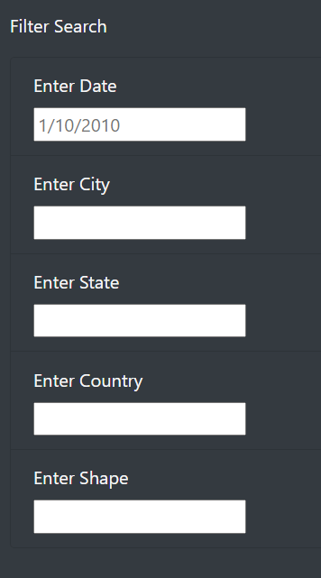
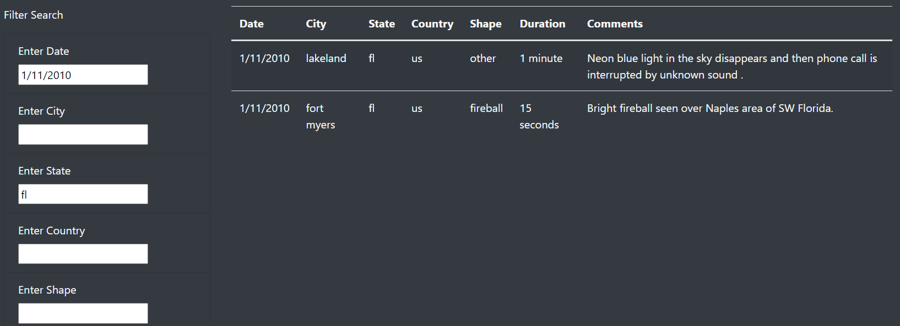

# UFO Webpage with Searchable Table

## Overview
The purpose of this project was to create a webpage that displayed data in a table. Using HTML, CSS, and JavaScript, I was able to produce the webpage and create loops that allow the table to be filtered based on user input. CSS enabled a more appealing design with an image from NASA, and a darker background color. HTML of course provided the remaining structure of the site, while JavaScript code tells the browser to call the data and format it in the table for viewing.

## Results
Users perform a search of the database by entering a date (mm/dd/yyyy) or any of the other categories in their respective window, then pressing enter or clicking outside of the window. This filters the table from the initial state, which is all data for 1/2010.
    

	
The image below depicts inputs that filter the table by date (1/11/2010) and state (fl), and displays two results in the dynamic table.
    

## Summary
For a relatively basic webpage, this UFO Finder gets the job done. One drawback, however, is the limited dataset. While a user might find this interesting, there may be far more dynamic and populated datasets out on the web. 

As for recommending further development, I would make the filter windows dropdown menus that allow the user to select from a list (e.g., list all countries, states, and shapes) while still allowing user input for date and city. Additionally, writing code that lets a user know their input will not return anything valid (e.g., date outside of data range, or city not in database) might make the user experience better.
